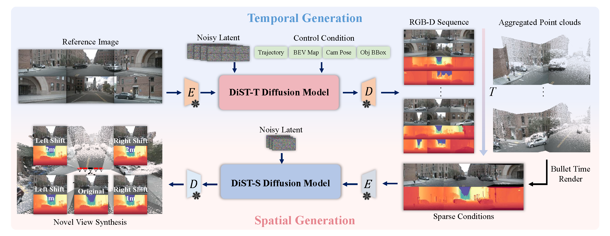

## DiST-4D: Disentangled Spatiotemporal Diffusion with Metric Depth for 4D Driving Scene Generation

[](https://arxiv.org/abs/) 

[](https://royalmelon0505.github.io/DiST-4D/)


*DiST-4D* is the first framework to achieve **feed-forward** dynamic 4D driving scene generation with both temporal extrapolation and spatial novel view synthesis.

### Framework:
<div align=center></div>

**Overall framework of the proposed DiST-4D.** DiST-4D is a disentangled spatiotemporal diffusion framework for 4D driving scene generation, leveraging metric depth as the core geometric representation to enable both temporal extrapolation and spatial novel view synthesis (NVS). 
**(Top: Temporal Generation)** DiST-T employs a diffusion model to predict future multi-camera RGB-D sequences from historical multi-camera images and control signals. The generated RGB-D sequences are then aggregated into point clouds, allowing for bullet time rendering. **(Bottom: Spatial Generation)** To enable spatial NVS, DiST-S leverages the predicted RGB-D sequences to generate novel viewpoints by first projecting them into sparse conditions and then refining them into dense RGB-D outputs.


### Abstract:
Current generative models struggle to synthesize dynamic 4D driving scenes that simultaneously support temporal extrapolation and spatial novel view synthesis (NVS) without per-scene optimization. A key challenge lies in finding an efficient and generalizable geometric representation that seamlessly connects temporal and spatial synthesis. To address this, we propose DiST-4D, the first disentangled spatiotemporal diffusion framework for 4D driving scene generation, which leverages metric depth as the core geometric representation. DiST-4D decomposes the problem into two diffusion processes: DiST-T, which predicts future metric depth and multi-view RGB sequences directly from past observations, and DiST-S, which enables spatial NVS by training only on existing viewpoints while enforcing cycle consistency. This cycle consistency mechanism introduces a forward-backward rendering constraint, reducing the generalization gap between observed and unseen viewpoints. Metric depth is essential for both accurate reliable forecasting and accurate spatial NVS, as it provides a view-consistent geometric representation that generalizes well to unseen perspectives. Experiments demonstrate that DiST-4D achieves state-of-the-art performance in both temporal prediction and NVS tasks, while also delivering competitive performance in planning-related evaluations.


### News
- [2025/3]: Paper is on [arxiv](https://arxiv.org/abs/).
- [2025/3]: Demo is released on [Project Page](https://royalmelon0505.github.io/DiST-4D/).


### Related Projects
Thanks to these excellent open-sourced repos: [TransMVSNet](https://github.com/megvii-research/TransMVSNet),[DepthLab](https://github.com/ant-research/DepthLab),[MagicDriveDiT](https://github.com/flymin/MagicDriveDiT),[FreeVS](https://github.com/esdolo/FreeVS),[ViewCrafter](https://github.com/Drexubery/ViewCrafter)


### Citation
If you find our paper and code useful for your research, please consider citing:

```bibtex

@article{guo2024dist4d,
  title={DiST-4D: Disentangled Spatiotemporal Diffusion with Metric Depth for 4D Driving Scene Generation},
  author={},
  journal={arXiv preprint arXiv:2503.},
  year={2025}
}
```
